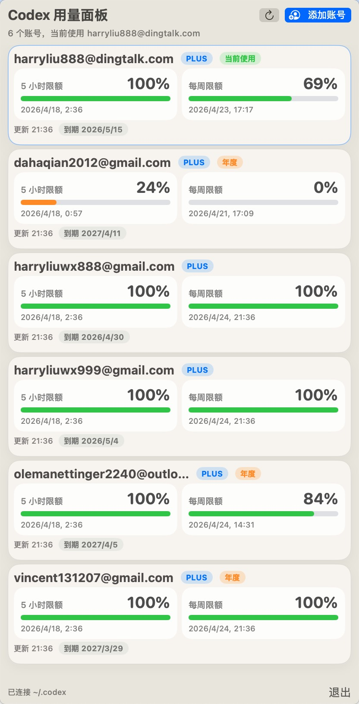
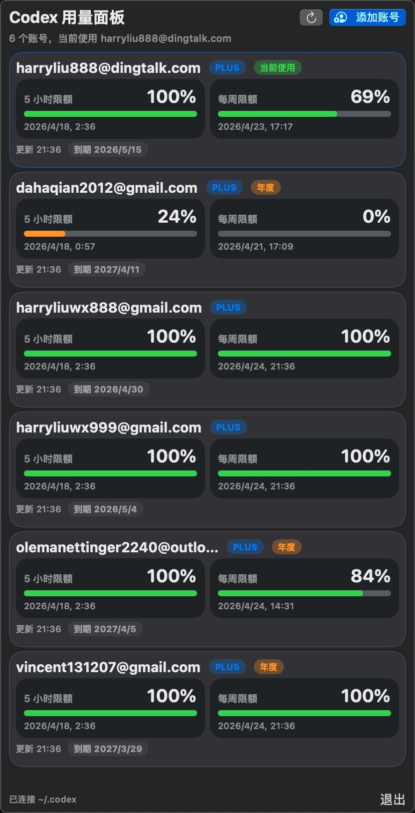

# CodexMonitor

CodexMonitor 是一个原生 macOS 菜单栏应用，用来集中查看多个 Codex / ChatGPT 账号的用量、订阅到期时间以及当前激活账号状态。

它的核心目标不是重新发明一套账号系统，而是直接复用 `~/.codex` 下已经存在的官方登录数据与账号快照，让 GUI 和 Codex CLI 保持同一份事实来源。

## 项目特点

- 原生菜单栏体验，不依赖常驻主窗口
- 自动读取 `~/.codex/auth.json`、`~/.codex/accounts/registry.json` 与 `~/.codex/accounts/*.auth.json`
- 支持直接调用官方 `codex login` 完成浏览器登录，不再手动复制 curl
- 支持多账号展示、切换账号、删除账号
- 支持拉取 5 小时额度、每周额度、订阅到期时间
- 订阅信息会缓存到 `~/.codex/accounts/subscriptions.json`，保证应用重启后也能立即显示
- 支持亮色 / 暗色模式

## 界面预览

| 亮色主题 | 暗色主题 |
| --- | --- |
|  |  |

## 当前实现说明

当前程序直接依赖官方 `codex` 命令与 `~/.codex` 目录，账号数据不会再额外维护一套独立数据库。

主要复用的本地文件包括：

- `~/.codex/accounts/registry.json`
- `~/.codex/accounts/*.auth.json`
- `~/.codex/auth.json`
- `~/.codex/accounts/subscriptions.json`

## 功能概览

### 账号管理

- 自动发现本机 `~/.codex` 中已有账号
- 支持从菜单栏直接发起官方登录流程
- 登录完成后自动同步新账号到账号列表
- 支持切换当前使用账号
- 支持删除账号，并同步清理订阅缓存

### 用量展示

- 展示 5 小时额度
- 展示每周额度
- 支持手动刷新单个账号或全部账号
- 支持在底部切换“所有账号 / 可用账号”显示范围
- 当 5 小时限额或每周限额任一窗口剩余为 `0%` 时，该账号会被判定为不可用
- 支持最多按 7 张卡片的高度动态计算菜单栏面板尺寸

### 订阅展示

- 展示订阅到期时间
- 距离到期小于等于 5 天时显示警告色
- 距离到期小于等于 1 天时显示错误色
- 距离到期大于 31 天时，PLUS 账号额外显示“年度”标记
- 订阅信息默认每 12 小时刷新一次

## 数据目录

默认使用真实用户目录下的 `~/.codex`。

主要文件如下：

- `~/.codex/auth.json`
  当前激活账号
- `~/.codex/accounts/registry.json`
  账号注册表与最近一次用量快照
- `~/.codex/accounts/*.auth.json`
  每个账号各自的认证快照
- `~/.codex/accounts/subscriptions.json`
  GUI 自己维护的订阅缓存

如果设置了 `CODEX_HOME`，程序会优先使用该目录。

## 构建要求

- macOS 15+
- Xcode 16.2+
- 已安装可用的官方 `codex` 命令

## 本地构建

```bash
xcodebuild \
  -project CodexMonitor.xcodeproj \
  -scheme CodexMonitor \
  -configuration Release \
  -derivedDataPath Build
```

构建产物位于：

```bash
Build/Products/Release/CodexMonitor.app
```

## 安装到 Applications

```bash
rm -rf /Applications/CodexMonitor.app
ditto Build/Products/Release/CodexMonitor.app /Applications/CodexMonitor.app
open -n /Applications/CodexMonitor.app
```

## 使用方式

### 添加账号

1. 点击菜单栏图标
2. 点击“添加账号”
3. 程序会后台执行官方 `codex login`
4. 浏览器登录完成后，账号会自动出现在列表中

如果登录过程中想取消，可以再次点击按钮取消当前登录流程。

### 切换账号

1. 把鼠标移动到对应账号卡片上
2. 点击“切换”
3. 程序会把该账号写回 `~/.codex/auth.json`
4. 根据实际使用场景，可能需要重启 Codex CLI / Codex App 才会完全生效

### 删除账号

1. 把鼠标移动到对应账号卡片上
2. 点击删除按钮
3. 在确认弹窗中再次确认

删除后会同步删除该账号的认证快照和订阅缓存。

### 筛选账号

1. 在菜单栏面板底部找到“显示”下拉框
2. 选择“所有账号”可以查看完整账号列表
3. 选择“可用账号”后，只会显示当前仍有可用额度的账号

可用性规则如下：

- 5 小时限额剩余为 `0%` 时，账号视为不可用
- 每周限额剩余为 `0%` 时，账号视为不可用
- 任一已知额度窗口为 `0%`，该账号都会从“可用账号”列表中隐藏

## 项目结构

```text
CodexMonitor/
├── CodexMonitor/
│   ├── Models/       # 账号、用量、订阅缓存等数据模型
│   ├── Services/     # 认证存储、官方登录、接口请求、状态管理
│   ├── Views/        # 菜单栏主界面与账号卡片 UI
│   ├── Assets.xcassets/
│   └── CodexMonitorApp.swift
├── CodexMonitor.xcodeproj/
├── Build/
├── docs/
│   └── images/       # README 使用的界面截图
└── README.md
```

## 后续可优化方向

- 增加账号分组与排序
- 增加刷新失败原因的更清晰提示
- 增加更细粒度的订阅状态说明
- 增加更完整的启动项与更新策略说明
